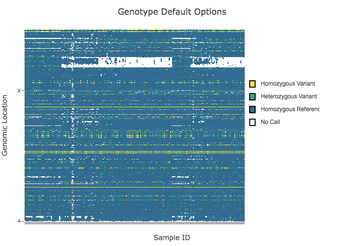
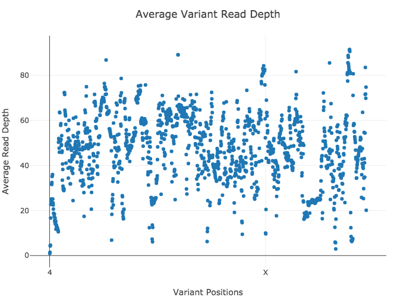

# Examples

To run examples, download the five test files found [here](https://github.com/compbiocore/VariantVisualization.jl/tree/master/test/test_files) and put them into a working directory with the VIVA script. 

Once Julia and VariantVisualization.jl are installed, you can run the following examples and should see the same outputs.

## Default Options

Running VIVA with no options produces heatmaps of genotype and read depth values for all samples and variant positions in the VCF file with default options. You can read about VIVA's default settings [here](https://compbiocore.github.io/VariantVisualization.jl/stable/#default-options)

```
julia VIVA -f test_4X_191.vcf -t Default_Options -s png
```




## Grouping Samples by Metadata Traits and Generating all Four Plots

Group samples by sequencing facility and generate heatmaps of genotype and read depth values as well as scatter plots of average read depth for both all selected samples and all selected variant positions. 

You can find grouping options [here]([options](https://compbiocore.github.io/VariantVisualization.jl/stable/filtering_vcf/#selecting-and-grouping-samples) to group samples by common traits.)

```
julia VIVA -f test_4X_191.vcf -t Grouped_by_Sequencing_Site -g sample_metadata_matrix.csv seq_site_1,seq_site_2 --avg_dp variant,sample -s png
```





 
##Genomic Range and Samples Selection - Genotype and Read Depth Heatmaps with Variant Position Labels

Generate heatmaps of genotype and read depth values of variants selected within a genomic range, in this case, chromosome 4, nucleotides 200000-500000, with y-axis variant position labels.

```
julia VIVA -f test_4X_191.vcf -t Genomic_Range_Chr4:3076150-3076390 -r chr4:3076150-3076390 -y positions --select_samples select_samples_list.txt -s png
```


